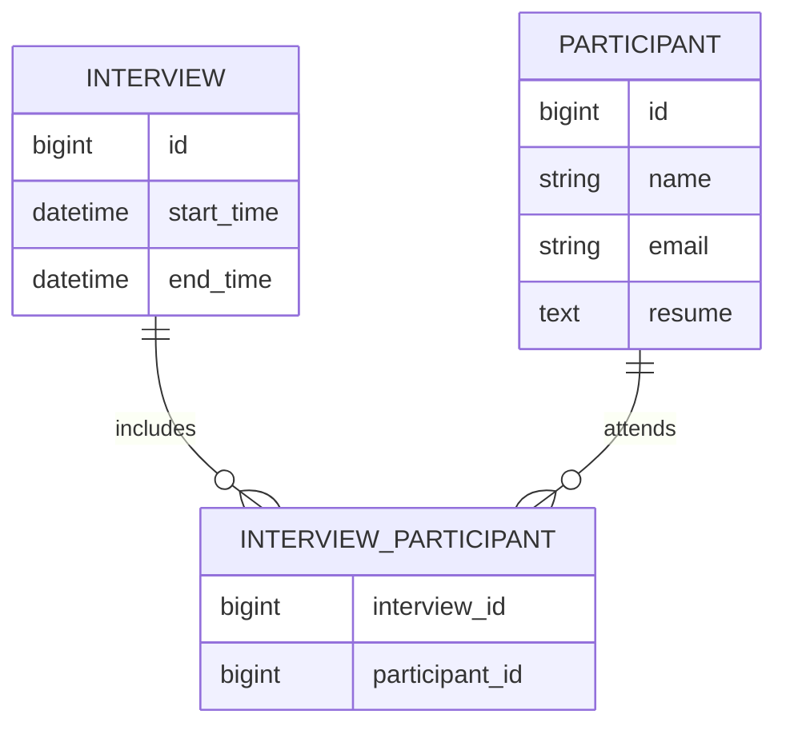

# Interview Scheduler App

A Ruby on Rails application for creating, viewing, updating, and coordinating interviews with multiple participants. The project keeps interview time ranges and participant relationships in PostgreSQL, prevents participant scheduling conflicts, and sends update reminders through Action Mailer.

## Table of contents

- [Overview](#overview)
- [Core features](#core-features)
- [Technology stack](#technology-stack)
- [Project structure](#project-structure)
- [Data model](#data-model)
- [Application flow](#application-flow)
- [Local setup](#local-setup)
- [Database setup](#database-setup)
- [Running the application](#running-the-application)
- [Running tests](#running-tests)
- [Scheduled tasks](#scheduled-tasks)
- [Configuration and security](#configuration-and-security)
- [Known limitations](#known-limitations)
- [Development roadmap](#development-roadmap)
- [Contributing](#contributing)
- [License](#license)

## Overview

Interview Scheduler App provides a small scheduling workflow for teams that need to coordinate interviews and participants. An interview has a start time, an end time, and one or more participants. The application checks existing participant bookings before accepting a requested time range.

The repository currently uses a traditional server-rendered Rails structure. Rails controllers coordinate requests, Active Record models manage persistence, ERB templates render the user interface, and Action Mailer handles interview update notifications.

## Core features

- Create interviews with start and end timestamps.
- Associate multiple participants with an interview.
- View scheduled interviews from the home page.
- Open an individual interview and review its participants.
- Edit interview times and replace the participant list.
- Prevent participants from being assigned to clashing interviews.
- Remove interview-participant relationships when an interview is deleted.
- Send reminder emails when an interview is updated.
- Run scheduled mail-related tasks through the Whenever gem.
- Exercise models, controllers, mailers, and application behavior through Rails tests.

## Technology stack

| Area | Technology |
| --- | --- |
| Backend | Ruby 2.6.6 and Ruby on Rails 6.0.3 |
| Database | PostgreSQL |
| ORM | Active Record |
| Frontend | ERB, SCSS, Rails UJS, Turbolinks |
| JavaScript build | Webpacker 4 |
| Application server | Puma |
| Email | Action Mailer |
| Scheduled tasks | Whenever |
| Testing | Minitest, Capybara, Selenium |
| Package managers | Bundler and Yarn |

> Ruby 2.6 and Rails 6.0 are legacy versions. Use the pinned versions when reproducing the existing environment, and plan framework upgrades as reviewed, incremental changes.

## Project structure

The Rails application is stored inside the nested `Interview_Scheduler_App/` directory.

```text
Interview_Scheduler_App/
├── app/
│   ├── controllers/       # Request handling
│   ├── mailers/           # Interview notification mailers
│   ├── models/            # Interview and participant records
│   ├── views/             # ERB pages and email templates
│   └── javascript/        # Webpacker entry points
├── config/
│   ├── environments/      # Environment-specific Rails settings
│   ├── routes.rb          # Application routes
│   ├── database.yml       # PostgreSQL configuration
│   └── schedule.rb        # Whenever schedule
├── db/
│   ├── migrate/           # Database migrations
│   ├── schema.rb          # Current database structure
│   └── seeds.rb           # Optional seed data
├── test/                  # Minitest test suite
├── Gemfile                # Ruby dependencies
├── package.json           # JavaScript dependencies
└── README.md
```

## Data model

### Interview

An interview stores `start_time` and `end_time`. It has many participants through the interview-participant join model.

### Participant

A participant stores a name, email address, and resume text. A participant can belong to many interviews.

### InterviewParticipant

This join model connects an interview to a participant. Both parent relationships are protected with database foreign keys.



## Application flow

### Creating an interview

1. Open the new-interview form.
2. Select the requested start and end times.
3. Submit the participant identifiers expected by the current controller.
4. The application checks each participant's existing interviews.
5. If no clash is detected, the interview and join records are created.
6. The browser is redirected to the interview details page.

### Updating an interview

1. Load the target interview by its identifier.
2. Parse the new time range and participant list.
3. Run conflict detection for the proposed schedule.
4. Update only the selected interview.
5. Replace its participant relationships.
6. Deliver an update reminder to each resolved participant.
7. Redirect to the updated interview page.

## Local setup

### Prerequisites

Install the following tools before starting:

- Git
- Ruby 2.6.6
- Bundler compatible with the lockfile
- PostgreSQL
- Node.js
- Yarn

### Installation

```bash
git clone https://github.com/deepakvish001/Interview_Scheduler_App.git
cd Interview_Scheduler_App/Interview_Scheduler_App
bundle install
yarn install
```

If your machine cannot install Ruby 2.6.6 directly, use a Ruby version manager or a containerized development environment. Do not silently update Ruby or Rails versions without also reviewing the lockfile, framework defaults, and test suite.

## Database setup

The existing database configuration expects PostgreSQL and defines these databases:

- `development_interview`
- `test_interview`
- `production_interview`

Review `config/database.yml` and replace the legacy local credentials with settings appropriate for your environment. Then prepare the development and test databases:

```bash
bin/rails db:create
bin/rails db:migrate
bin/rails db:seed
bin/rails db:test:prepare
```

The seed file is currently a placeholder, so a clean setup does not create sample participants or interviews automatically.

## Running the application

Start the Rails development server:

```bash
bin/rails server
```

Open [http://localhost:3000](http://localhost:3000) in a browser.

For live JavaScript compilation during frontend development, run Webpacker in another terminal:

```bash
bin/webpack-dev-server
```

## Running tests

Run the complete Rails test suite:

```bash
bin/rails test
```

Run system tests separately:

```bash
bin/rails test:system
```

Run a focused test file:

```bash
bin/rails test test/controllers/interviews_controller_test.rb
```

Before merging a change, test the successful path, invalid input, scheduling conflicts, and any database or email side effects introduced by that change.

## Scheduled tasks

The project uses the Whenever gem. `config/schedule.rb` currently invokes `my_namespace:send_mail` every five minutes.

Preview the generated cron configuration:

```bash
bundle exec whenever
```

Install or update the current user's crontab only after confirming that the referenced Rake task exists and the environment is configured correctly:

```bash
bundle exec whenever --update-crontab
```

Remove generated cron entries with:

```bash
bundle exec whenever --clear-crontab
```

## Configuration and security

- Do not commit real database passwords, mail credentials, API tokens, or Rails master keys.
- Move database credentials from `config/database.yml` to environment variables before deployment.
- Configure Action Mailer separately for development, test, and production.
- Treat participant names, email addresses, and resumes as private data.
- Validate uploaded resume type and size before replacing the current text-based approach with file storage.
- Use authorization checks before exposing participant or interview management outside a trusted environment.
- Keep application logs free of resumes, email bodies, credentials, and other sensitive values.
- Back application-level validations with database constraints for critical invariants.

## Known limitations

The current application is a learning-stage implementation and still has several areas that should be strengthened:

- Ruby 2.6.6 and Rails 6.0.3 require a planned upgrade.
- Database credentials are currently represented directly in the legacy configuration.
- Authentication and authorization are not implemented.
- Conflict detection needs clearer boundary and timezone rules.
- Controllers parse multipart date fields manually.
- Interview creation and participant assignment should use a database transaction.
- Email delivery is synchronous in the update request.
- The scheduled Rake task must be verified before enabling its cron entry.
- Resume storage is a plain text column rather than managed private attachment storage.
- The user interface needs stronger validation feedback, accessibility, and responsive styling.
- Production deployment, continuous integration, and operational monitoring are not yet documented in code.

## Development roadmap

Recommended implementation order:

1. Stabilize model validations and database constraints.
2. Add complete model, request, mailer, and system test coverage.
3. Extract scheduling and conflict logic into focused service objects.
4. Add authentication, authorization, and audit events.
5. Move reminder delivery to background jobs.
6. Introduce explicit timezone handling and calendar adapters.
7. Replace resume text storage with validated private attachments.
8. Add JSON APIs with consistent error responses and pagination.
9. Upgrade Ruby, Rails, Webpacker, and frontend dependencies.
10. Add continuous integration, deployment checks, structured logging, and health endpoints.

## Contributing

Keep pull requests small and focused:

1. Create a branch from `master`.
2. Make one cohesive change.
3. Add or update relevant tests and documentation.
4. Run the focused tests and then the complete suite.
5. Explain the problem, solution, and verification in the pull request.
6. Avoid mixing dependency upgrades, refactors, and product features in one change.

## License

No repository-level license has been declared yet. Add a license file before distributing or reusing the project outside its intended context.
